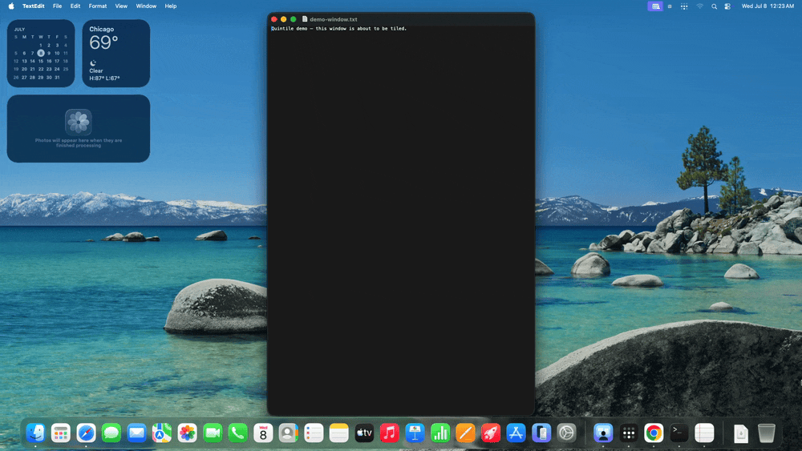
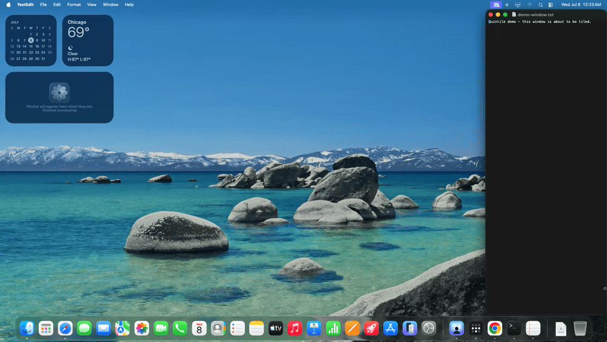
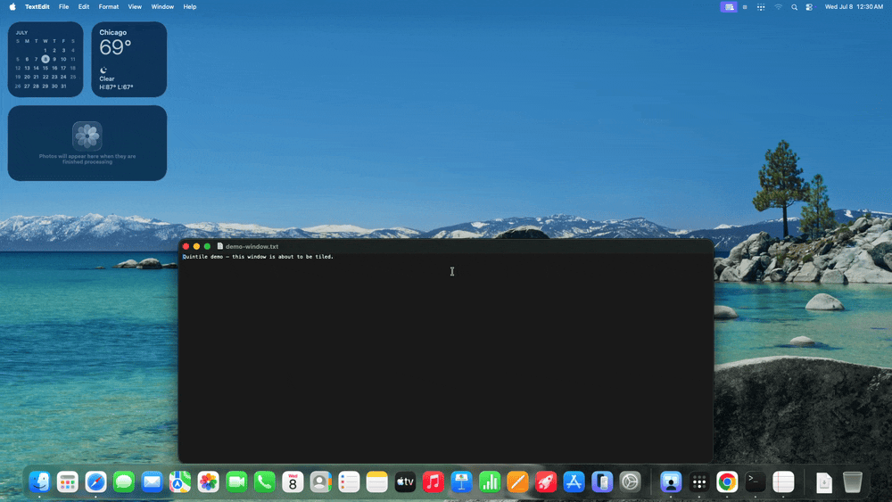

# Quintile

**Keyboard-only grid tiling for macOS.** Define any N×M grid per display, place
windows on any rectangular span of cells in two keypresses, and move them
around the grid — without ever touching the mouse.


Quintile is free, MIT-licensed, and built on the public Accessibility API
only: no SIP disabling, no scripting-addition injection, no private
frameworks. It survives macOS updates the same way Rectangle and AeroSpace do.

**Status:** v0.1.1 released · macOS 14+ · Apple Silicon · 124 tests passing ·
unsigned build ([details](#a-note-on-the-unsigned-build)). See
[docs/HANDOFF.md](docs/HANDOFF.md) for the full build log, decisions, and roadmap.

## Why Quintile

Most tiling tools stop at halves, quarters, and thirds. Quintile treats your
display as an arbitrary grid (say, 5×2 on a 32" monitor) and gives you a
keyboard-driven picker for *any rectangular span* of that grid — the top-left
2×1, the middle three columns, whatever your workflow wants.

No dedicated, zero-config tiling app ships an interactive keyboard N×M span
picker. The closest prior art is Hammerspoon's excellent `hs.grid` — which
requires writing Lua. Quintile gives you that interaction out of the box.

|  | Quintile | Rectangle Pro | Magnet | Moom | BetterSnapTool |
|--|----------|--------------|--------|------|----------------|
| Arbitrary N×M grid sizing | ✅ | ⚠️ fixed presets | ⚠️ fixed presets | ✅ | ✅ |
| Interactive multi-cell span picker (keyboard) | ✅ two keypresses | ❌ | ❌ | ⚠️ pointer-driven grid | ⚠️ pointer-driven |
| Three switchable grid profiles per display | ✅ | ❌ | ❌ | ⚠️ saved layouts | ❌ |
| Per-display defaults that survive reboots | ✅ | ✅ | ⚠️ | ✅ | ✅ |
| Keyboard-only by design | ✅ | ❌ | ❌ | ❌ | ❌ |
| Open source | ✅ MIT | ❌ | ❌ | ❌ | ❌ |
| Price | Free | $10 | $5 | $10 | $2 |

*Comparison reflects each product's published feature set at the time of
writing; corrections welcome.*

Keyboard-only is a permanent product principle, not a missing feature: no
mouse-drag snap zones, ever. A smaller, all-keyboard surface is what makes
the shortcuts stick.

## Install

**Homebrew:**

```sh
brew install --cask stefanopineda/quintile/quintile
```

**Manual:** download `Quintile.app.zip` from the
[latest release](https://github.com/stefanopineda/quintile/releases), unzip it,
move `Quintile.app` to `/Applications`, and launch it.

**From source** (Command Line Tools are enough — no Xcode needed):

```sh
git clone https://github.com/stefanopineda/quintile
cd quintile && make run
```

### A note on the unsigned build

Quintile is not yet signed with an Apple Developer ID or notarized (that needs a
paid Apple Developer Program membership). Without notarization, macOS Gatekeeper
would normally block first launch with *"Apple could not verify 'Quintile' is
free of malware"* — expected for any unsigned app, not a real malware warning.

**Installing with Homebrew handles this for you.** The cask clears the
Gatekeeper quarantine flag as a post-install step, so a plain

```sh
brew install --cask stefanopineda/quintile/quintile
```

installs an app that launches straight away — no extra steps. (This is necessary
because current Homebrew force-quarantines every cask and no longer has a
`--no-quarantine` opt-out; the cask does the unquarantining itself.)

**If you download `Quintile.app.zip` manually** — or macOS blocks it anyway —
clear the flag once yourself:

```sh
xattr -dr com.apple.quarantine /Applications/Quintile.app
```

or open Quintile, dismiss the dialog (click **Cancel**, *not* "Move to Trash"),
then go to **System Settings → Privacy & Security**, scroll to the Security
section, and click **Open Anyway**.

**After a `brew upgrade`** to a future version, the app's ad-hoc signature
changes, so macOS may treat it as a new app and ask you to grant Accessibility
again — a one-time click. All of this disappears once a Developer ID-signed,
notarized build ships.

### Granting Accessibility permission

Quintile moves windows through the macOS Accessibility API, which requires a
one-time permission grant:

1. Launch Quintile — the onboarding window appears and macOS shows the
   permission prompt.
2. Open **System Settings → Privacy & Security → Accessibility** (the
   onboarding window's button takes you straight there).
3. Enable **Quintile** in the list.

The menu-bar icon shows `⊞!` until permission is granted. That's the only
permission Quintile ever asks for — no Screen Recording, no network.

## The grid picker



Press `⌃⌥G` and the grid overlay appears on your focused window's display,
with a key label in every cell:

- **Two keypresses** place the window: first key sets one corner, second key
  sets the opposite corner — the window fills the span between them.
  Same key twice = that single cell.
- Or refine with **arrows** (move), **⇧+arrows** (extend a span),
  **⏎** (confirm), **esc** (cancel).

## Shortcuts

All shortcuts use the `⌃⌥` (Control+Option) leader. The full list also lives
in the app: **menu bar → Shortcuts…**

| Action | Shortcut |
|--------|----------|
| Grid picker (span selection) | `⌃⌥G` |
| Move window one cell | `⌃⌥←` `⌃⌥→` `⌃⌥↑` `⌃⌥↓` |
| Quadrants (TL / TR / BL / BR) | `⌃⌥1` … `⌃⌥4` |
| Thirds (left / center / right) | `⌃⌥[` `⌃⌥]` `⌃⌥\` |
| Sixths (thirds × top/bottom) | `⌃⌥⇧1` … `⌃⌥⇧6` |
| Cycle grid profile for current display | `⌃⌥P` |
| Send window to next display | `⌃⌥N` |



Moving a window into occupied cells relocates the occupants into the space
you vacated — sizes preserved, no windows lost off-grid. At a grid edge the
move is a no-op with a soft feedback cue, so you always know the keystroke
registered.

## Grid profiles



Every display carries three named grid profiles — **standard** (5×2 by
default), **secondary** (2×2), **tertiary** (3×2) — each independently
editable in Preferences (up to 10×4). `⌃⌥P` cycles the active profile for
the display holding your focused window and flashes the new grid so you can
see what you switched to. Cycling never moves your windows; it changes what
the grid *means* for the next placement.

Profiles are remembered per display — by hardware identity, not port — so
your 32" monitor keeps its 5×2 whether it's plugged into the dock or direct.

## macOS's own tiling shortcuts

macOS binds `Fn+Ctrl+Arrow` to its built-in half/quarter tiling. Quintile
ships an experimental "take over macOS tiling shortcuts" mode (off by
default) that intercepts those chords. Reliability varies by macOS version;
the dependable route is to disable the built-in shortcuts in **System
Settings → Keyboard** and let Quintile observe the chords — see the notes in
`Sources/QuintileCore/Hotkeys/SystemShortcutBridge.swift`.

## Troubleshooting

- **A window won't move or resize.** Some Electron and Java apps reject
  Accessibility resize requests. Quintile surfaces the failure (menu-bar
  flash) instead of silently doing nothing — the window, not Quintile, is
  declining.
- **Display forgets its profiles behind a KVM or dock.** Some KVMs/docks
  mangle the display serial number, so identity falls back to name +
  resolution; two identical serial-less monitors can collide. Known
  limitation for v1.
- **Hotkeys stopped working after revoking/re-granting permission.**
  Re-grant in System Settings; Quintile re-arms its event tap automatically
  on the next permission check (within ~3 s).

## Architecture

Quintile is a Swift Package with two targets:

- **`QuintileCore`** — all logic, with zero SwiftUI/window dependencies. The
  Accessibility API, the global event tap, and the permission trust check are
  each hidden behind a protocol seam, so the grid math, display identity,
  persistence, permission state machine, hotkey dispatch, grid-select state
  machine, and tiling actions are all unit-tested against fakes — no
  permissions or real display required.
- **`QuintileApp`** — a thin AppKit shell (LSUIElement menu-bar agent): the
  menu bar, the non-activating overlay panel, onboarding, preferences, and the
  `AppCoordinator` that wires everything together.

The canonical coordinate space is Quartz top-left-origin global; the single
Cocoa↔Quartz conversion lives in `WindowServer/CoordinateConversion.swift`.
Tests run as a plain executable (`make test` → `swift run quintile-tests`)
because Command Line Tools ship no usable XCTest/Swift Testing harness — the
`TestHarness` API mirrors Swift Testing so a move to `swift test` under full
Xcode is mechanical. See [CONTRIBUTING.md](CONTRIBUTING.md) for the full layout.

## Building & releasing

- `make test` — full test suite (120 tests; no permissions needed).
- `make app` — assembles `dist/Quintile.app` (ad-hoc signed) from the SPM
  build; see `Scripts/build-app.sh`.
- `make run` — build and launch.
- Real releases should be signed with a **Developer ID Application** identity
  and **notarized** (`CODESIGN_IDENTITY="Developer ID Application: …" make app`,
  then `notarytool` + `stapler`). The current v0.1.0 build is ad-hoc signed; the
  Homebrew cask works around Gatekeeper by clearing quarantine on install (see
  [the unsigned-build note](#a-note-on-the-unsigned-build)). Full release steps
  are in [docs/HANDOFF.md](docs/HANDOFF.md).

## Project status & roadmap

**Shipped in v0.1.0:** the grid-select overlay, quadrant/thirds/sixths presets,
move-within-grid, send-to-next-display, three switchable per-display profiles,
onboarding + preferences + login item, and the Homebrew tap — all reviewed and
tested. Full detail in [docs/HANDOFF.md](docs/HANDOFF.md).

**Next up (highest value first):**

1. **Developer ID signing + notarization** — removes every Gatekeeper/quarantine
   workaround; needs a paid Apple Developer Program membership.
2. Revisit two deferred product questions (optional retile-on-cycle; richer
   span-collision semantics) — both have working defaults today.
3. Roadmap: saved hotkey-bindable span presets, cross-display cell-by-cell move,
   a scriptable CLI / URL-scheme surface, and a universal (Intel) binary.

## License

[MIT](LICENSE). Contributions welcome — see [CONTRIBUTING.md](CONTRIBUTING.md).
