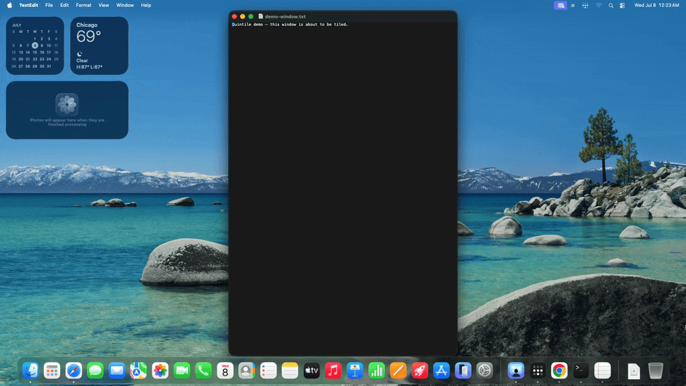
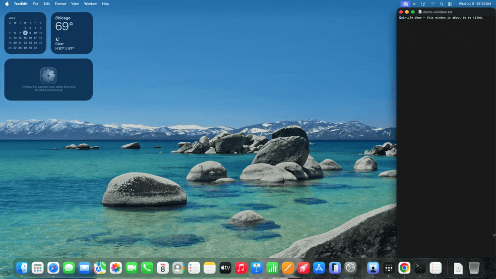
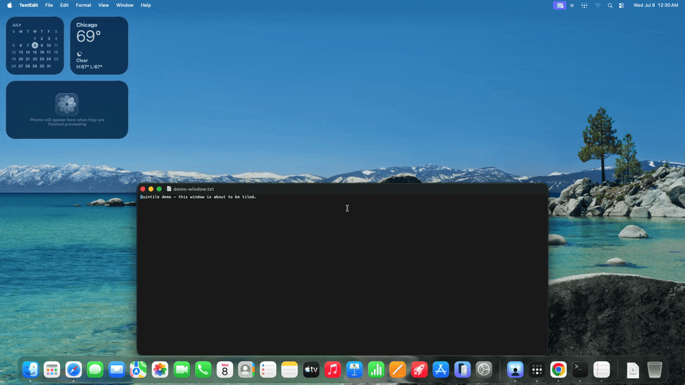

# Quintile

**Keyboard-only N×M grid window placement for macOS.**

Not another halves/thirds snap tool — place any window on **any rectangular span** of a grid you define. Two keypresses. No mouse. No auto-tiling. No SIP.

https://github.com/stefanopineda/quintile/raw/main/docs/demos/hero.mp4


- **span picker** — `⌃⌥G`, two cells, done  
- **arbitrary grids** — 5×2, 4×3, whatever fits the display  
- **presets + profiles** — thirds, quarters, three grids per display  
- **Accessibility API only** — no private frameworks, no SIP hacks  
- **free, MIT** · Developer ID signed & notarized  

---

## for / not for

| You want… | Quintile |
|-----------|----------|
| Place a window on columns 1–3 of a 5-wide grid from the keyboard | Yes — that’s the point |
| Halves / thirds / quarters only | Works, but [Rectangle](https://github.com/rxhanson/Rectangle) already covers this well |
| Auto-tiling / BSP / yabai layouts | No — you place windows; nothing rearranges for you |
| Mouse drag-to-snap zones | No — keyboard-only by design |
| SIP-disabled scripting additions | No — public Accessibility API only |

**Laptop:** start with thirds (`⌃⌥[` `]` `\`). The 5×2 default shines when you have width (external / ultrawide).

---

## 30 seconds to first tile

```bash
brew install --cask stefanopineda/quintile/quintile
```

or:

```bash
brew tap stefanopineda/quintile
brew install --cask quintile
```

or download [Quintile.app.zip](https://github.com/stefanopineda/quintile/releases/latest) · or `git clone` + `make run`

> Official `brew install --cask quintile` (homebrew/cask) opens once this repo meets [Homebrew notability](https://docs.brew.sh/Package-Acceptance-Policy#notability) for self-submissions: **≥225 stars**, or ≥90 forks, or ≥90 watchers. Prior PR: [homebrew-cask#274471](https://github.com/Homebrew/homebrew-cask/pull/274471). Until then use the tap above — same app, one extra word.

### after install

Quintile is a **menu bar app** (no Dock icon).

1. Open it: Spotlight (**⌘Space**) → `Quintile` → Enter  
2. Look for **⊞!** / **⊞** near the clock  
3. **System Settings → Privacy & Security → Accessibility → Quintile** ON  
   (if it already looks ON after an update: OFF then ON, then **Check Again**)  
4. Click a real app window → hold **Control+Option** → press **`[`** (left third)

Full map later: menu bar **⊞ → Quick Start…**

### upgrade / reinstall

```bash
brew reinstall --cask stefanopineda/quintile/quintile
# if brew says "already installed" but the app is gone:
brew uninstall --cask --force --zap stefanopineda/quintile/quintile
brew install --cask stefanopineda/quintile/quintile
```

---

## the thing most tilers don’t do

Hold **Control+Option**, press **G**, type two cell keys. The focused window fills that rectangle.



Presets when you don’t need a custom span:



Three grid profiles per display — cycle with `⌃⌥P` (doesn’t re-tile existing windows):



---

## keys

Start with thirds. Everything else is optional.

| chord | action |
|-------|--------|
| `⌃⌥[` `]` `\` | left / center / right third |
| `⌃⌥1…4` | quadrants |
| `⌃⌥⇧1…6` | sixths |
| `⌃⌥G` then two cells | span any rectangle on the grid |
| `⌃⌥←↑↓→` | move within grid |
| `⌃⌥P` | cycle grid profile |
| `⌃⌥N` | next display |

Leader is **control + option**. Hold it, hit a key.

---

## from source

```bash
git clone https://github.com/stefanopineda/quintile
cd quintile && make run
```

```bash
make test
make app    # dist/Quintile.app
```

---

## status

v0.1.8 · macOS 14+ · Apple Silicon · Developer ID signed & notarized

First-run notes or bugs → [Issues](https://github.com/stefanopineda/quintile/issues).  
If the two-cell span picker stuck for you, a star helps clear [Homebrew notability](https://docs.brew.sh/Package-Acceptance-Policy#notability) so install can become `brew install --cask quintile`.

## license

[MIT](LICENSE)
