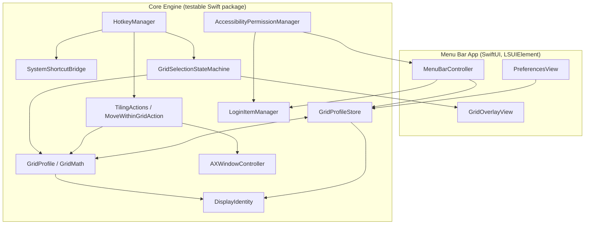
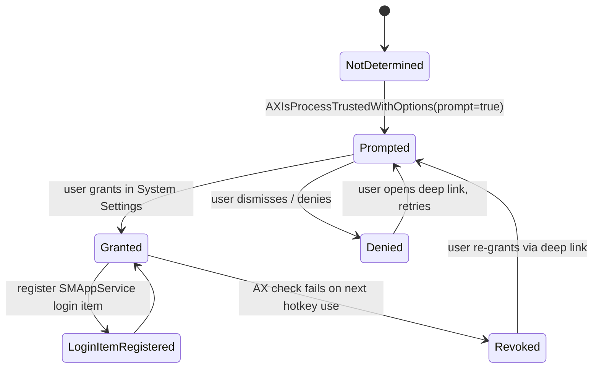
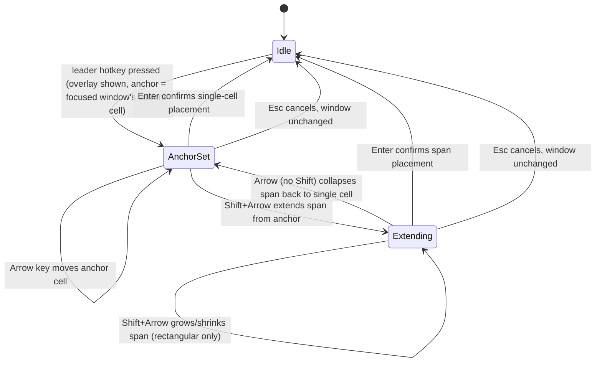

# feat: Quintile — keyboard-only macOS grid tiling window manager

**Target repo:** `quintile` (new, created at `~/Developer/quintile` on host `studio`, GitHub owner `stefanopineda`)

## Summary

Quintile is a free, open-source, keyboard-only macOS window tiling manager built on the public Accessibility API only (no SIP disable, no scripting-addition injection, no private WindowServer APIs). It ships three user-defined grid profiles (standard / secondary / tertiary) that are independently assignable per display and persist across reboots, an arbitrary N×M grid with keyboard-driven rectangular multi-cell span selection (the one interaction no surveyed open-source competitor implements), move-within-grid shortcuts, and a best-effort takeover of macOS's existing Fn+Ctrl+Arrow gesture so the shortcut muscle-memory transfers — with a reliable custom-leader-key binding as the guaranteed fallback. The product principle is explicit: keyboard-only by design ("addition by subtraction") — no mouse-drag snap zones, ever — because a smaller, all-keyboard surface is what makes the shortcuts sticky and teachable.

## Problem Frame

Existing open-source macOS tiling tools split into two camps: pure-Accessibility-API tools (AeroSpace, Rectangle, Loop) that stay stable across macOS updates but cap out at halves/quarters/thirds, and yabai's SIP-partially-disabled scripting-addition approach that unlocks deeper control at the cost of documented, recurring breakage after macOS updates (see Sources & Research). None of them ship an interactive arbitrary-grid, multi-cell-span picker, and none combine per-display grid *profiles* (plural, switchable) with reboot-persistent per-display defaults. Paid tools (Rectangle Pro, Magnet, Moom, BetterSnapTool) fill some of this gap but are closed-source and priced — the target market for an open-source alternative that is *more* flexible, not less.

The user wants a 32" display tiled 5 columns × 2 rows, with fast keyboard access to quadrants, thirds, top/bottom-within-thirds, and arbitrary spans — plus the ability to swap between three saved grid layouts per monitor and move already-placed windows around the grid without touching the mouse.

## Requirements

- **R1**: Provide quadrant (2×2), horizontal-thirds (left/center/right), and vertical-thirds (top/bottom) tiling actions, each bound to a keyboard shortcut.
- **R2**: Provide a user-configurable arbitrary N×M grid (default secondary profile: 5 columns × 2 rows) with keyboard-driven selection of a single cell or a rectangular multi-cell span.
- **R3**: Support three named grid profiles per display — standard, secondary, tertiary — each independently configurable (rows, cols, and any preset cell groupings). A single shortcut cycles the active profile for the display holding the focused window.
- **R4**: Provide keyboard shortcuts to move the frontmost tiled window one cell in a direction (up/down/left/right) within the active grid, swapping with any window occupying the destination.
- **R5**: Reuse macOS's existing Fn+Ctrl+Arrow shortcut as the primary binding on a best-effort basis; ship a reliable custom leader-key binding as the guaranteed fallback regardless of interception success.
- **R6**: Support multiple displays, each with its own independently toggleable active grid profile.
- **R7**: Persist each display's assigned grid profiles and active-profile selection across reboots, keyed on a display identity that survives cable/dock changes where possible.
- **R8**: Request Accessibility permission on first run with a clear onboarding flow; register the app as a login item only after permission is confirmed granted, never before.
- **R9**: Ship as a public MIT-licensed GitHub repo with a README that positions Quintile against Rectangle Pro, Magnet, Moom, and BetterSnapTool, install instructions (Homebrew tap + manual), and recorded demo GIFs of the core interactions.
- **R10 (non-goal, explicit)**: No mouse-drag snap-zone interaction, ever. Keyboard-only is a permanent product principle, not a v1 scope cut.

## Key Technical Decisions

- **Accessibility-API-only architecture, no SIP, no private APIs.** Rationale: yabai's SIP-partial-disable + Dock.app scripting-addition injection is documented to break repeatedly across macOS updates (GitHub issues #2134, #2596, #1864, #2747 per research); AeroSpace and Rectangle prove the pure-AX-API path is stable and update-resilient at scale (29k★+ each). See Sources & Research.
- **No animations, no Screen Recording permission in v1.** Rationale: yabai's window-animation features require Screen Recording permission on top of Accessibility; dropping animations keeps the permission surface to a single grant (Accessibility only), matching AeroSpace's minimal-permission philosophy and simplifying the onboarding flow (R8).
- **Grid-cell addressing model combines two validated prior-art patterns**: normalized fractional `[x, y, width, height]` coordinates (yannpom/Grid's approach, confirmed via research) for storage/portability, plus a `rows:cols:startCol:startRow:colSpan:rowSpan` addressing scheme (yabai's `--grid` CLI argument shape, confirmed via primary docs) for the in-memory selection model. Rationale: the fractional form is what gets persisted and is display-size-independent; the row/col form is what the keyboard interaction manipulates.
- **Rectangular spans only.** No L-shaped or non-contiguous multi-cell selection. Rationale: keeps the selection state machine (Idle → Anchor → Extend → Confirm) simple, matches the mental model of every prior-art grid tool surveyed, and is sufficient for the stated use cases.
- **Move-into-occupied-cell defaults to swap**, not push or no-op. Rationale: matches the behavior users of BSP-style tools (yabai, i3) already expect; push semantics would require cascading multiple windows and is deferred (see Scope Boundaries).
- **A new display auto-receives the "standard" profile on first connect**, not left unconfigured. Rationale: immediate usability; user can reassign via preferences at any time.
- **Display identity for persistence uses a composite key**: vendor ID + model ID + serial number (via IOKit/CGDisplay APIs) with resolution as a secondary disambiguator, falling back to `NSScreen.localizedName` + resolution when serial is unavailable (some displays/adapters don't expose EDID serial). Rationale: `CGDirectDisplayID` is not stable across reboots or port/dock changes; the vendor+model+serial composite is the pattern Rectangle and yabai both use.
- **Fn+Ctrl+Arrow interception is explicitly best-effort, validated by an early spike (U5).** Rationale: the combo is bound early in WindowServer as of recent macOS releases; reliable suppression of the system handler without private APIs is unproven. The plan does not gate later units on spike success — the custom leader-key binding is the primary, always-available path, and Fn+Ctrl+Arrow becomes an opt-in "steal the OS binding" mode layered on top if the spike succeeds.
- **Grid-select interaction is a modal, full-screen, per-display keyboard-driven overlay** (see High-Level Technical Design). Rationale: this is the one interaction with zero prior art among surveyed competitors (research explicitly confirmed no tool ships an interactive N×M span picker); the design needed to be specified from scratch rather than copied.
- **Distribution via a personal Homebrew tap (`stefanopineda/quintile`), not `homebrew-core`.** Rationale: standard bootstrap path for a new cask; core-tap submission requires an established user base Quintile doesn't have yet.

## High-Level Technical Design

### Component architecture



### Permission & login-item flow



### Grid-select interaction state machine (keyboard-only, the novel UX)



## Output Structure

```text
quintile/
├── LICENSE                          # MIT
├── README.md
├── CONTRIBUTING.md
├── Package.swift                    # SPM workspace: QuintileCore + QuintileApp
├── Sources/
│   ├── QuintileCore/                # testable, no SwiftUI/AppKit imports where possible
│   │   ├── Permissions/AccessibilityPermissionManager.swift
│   │   ├── WindowServer/AXWindowController.swift
│   │   ├── Displays/DisplayIdentity.swift
│   │   ├── Persistence/GridProfileStore.swift
│   │   ├── Grid/GridProfile.swift
│   │   ├── Grid/GridMath.swift
│   │   ├── Hotkeys/HotkeyManager.swift
│   │   ├── Hotkeys/SystemShortcutBridge.swift
│   │   ├── UI/GridSelectionStateMachine.swift
│   │   ├── Actions/TilingActions.swift
│   │   ├── Actions/MoveWithinGridAction.swift
│   │   └── App/LoginItemManager.swift
│   └── QuintileApp/                 # thin SwiftUI/AppKit shell, LSUIElement menu-bar agent
│       ├── QuintileApp.swift
│       ├── UI/MenuBarController.swift
│       ├── UI/PreferencesView.swift
│       └── UI/GridOverlayView.swift
├── Tests/
│   └── QuintileCoreTests/
│       ├── AccessibilityPermissionManagerTests.swift
│       ├── AXWindowControllerTests.swift
│       ├── DisplayIdentityTests.swift
│       ├── GridProfileStoreTests.swift
│       ├── GridMathTests.swift
│       ├── HotkeyManagerTests.swift
│       ├── GridSelectionStateMachineTests.swift
│       ├── TilingActionsTests.swift
│       └── MoveWithinGridActionTests.swift
├── Casks/
│   └── quintile.rb                  # Homebrew tap formula (stefanopineda/homebrew-quintile)
└── docs/
    ├── plans/
    ├── demos/                       # recorded GIFs, one per checkpoint (see U6, U7, U8)
    └── solutions/
```

## Scope Boundaries

**In scope:** everything in Requirements R1–R9.

**Explicit non-goals (not deferred — permanent product decisions):**
- Mouse-drag snap zones or any pointer-driven tiling interaction (R10). Keyboard-only is the product identity.
- Mac App Store distribution — incompatible with unrestricted Accessibility API usage under App Sandbox (confirmed via research).
- Non-rectangular (L-shaped, disjoint) multi-cell spans.

**Deferred to Follow-Up Work:**
- Window animations and the associated Screen Recording permission gate.
- Push-semantics (cascade) as an alternative to swap for move-within-grid collisions.
- Cross-display move-within-grid (moving a window off the edge of one display's grid onto an adjacent display).
- `homebrew-core` cask submission (ships via personal tap first).
- Non-English localization of the README/onboarding copy.

## System-Wide Impact

Single-user, single-machine macOS utility with no server component and no data leaving the device — persistence is local (UserDefaults or a local JSON store), so there is no cross-system or multi-tenant impact. The only external-facing surface is the public GitHub repo itself (README, releases, Homebrew tap), which affects prospective users and contributors, not any existing system.

---

## Implementation Units

### Phase A — Core Engine

### U1. Accessibility Permission & Onboarding Flow

**Goal:** Detect, request, and monitor Accessibility permission; drive the onboarding UI state shown in the High-Level Technical Design permission flow diagram.

**Requirements:** R8

**Dependencies:** none (first unit)

**Files:**
- `Sources/QuintileCore/Permissions/AccessibilityPermissionManager.swift`
- `Tests/QuintileCoreTests/AccessibilityPermissionManagerTests.swift`

**Approach:** Wrap `AXIsProcessTrustedWithOptions` (prompt-on-first-check) behind a small state enum (`notDetermined`, `granted`, `denied`). Poll on a low-frequency timer (e.g., every few seconds while not granted, or on-demand before each hotkey-triggered action) rather than relying solely on notifications, since macOS does not reliably notify apps of AX grant changes. Expose a deep-link helper to `x-apple.systempreferences:com.apple.preference.security?Privacy_Accessibility`. Do not touch login-item registration here — that is U8's responsibility, triggered by this manager's `granted` transition.

**Test scenarios:**
- Not-yet-determined state on fresh install returns `notDetermined` and triggers the OS prompt exactly once per cold launch.
- Transition from `notDetermined` to `granted` is detected within one polling interval after permission is granted externally.
- Transition from `granted` to `denied` (permission revoked while running) is detected on the next permission check and surfaces a distinct state from initial `notDetermined`.
- Deep-link URL construction is correct and does not vary by macOS version within the supported range.
- Repeated calls while already `granted` do not re-trigger the OS prompt.

**Verification:** Manager correctly reports all three states across a manual grant/revoke/re-grant cycle in System Settings; the app never silently assumes permission without checking.

---

### U2. Window Manipulation Core (AX wrapper)

**Goal:** A thin, testable wrapper over `AXUIElement` for reading and setting window frames, enumerating windows, and identifying the frontmost/focused window per display.

**Requirements:** R1, R2, R4

**Dependencies:** U1 (permission gating — this unit's calls are no-ops/errors when permission is not granted)

**Files:**
- `Sources/QuintileCore/WindowServer/AXWindowController.swift`
- `Tests/QuintileCoreTests/AXWindowControllerTests.swift`

**Approach:** Provide `getFrame`, `setFrame`, `focusedWindow()`, `windows(onDisplay:)`. Handle and surface (not silently swallow) AX errors such as `kAXErrorCannotComplete` and windows that reject `kAXPositionAttribute`/`kAXSizeAttribute` writes (some Electron/Java apps are known-flaky per research on AX-API-based tools generally). Frame reads/writes operate in global (non-flipped-per-display) screen coordinates, converted to/from per-display normalized coordinates by `GridMath` (U4), not here.

**Test scenarios:**
- Setting a frame on a window that accepts AX writes results in the read-back frame matching within floating-point tolerance.
- Setting a frame on a window that rejects size/position writes surfaces a typed error rather than throwing an unhandled exception or silently no-op-ing.
- `focusedWindow()` returns nil (not a crash) when no app has a focused window (e.g., Finder desktop focus).
- `windows(onDisplay:)` correctly partitions windows by which display contains the majority of their current frame's area, for a window straddling two displays.

**Verification:** Can programmatically move and resize a real window (e.g., TextEdit) to a specified frame and read the resulting frame back correctly.

---

### U3. Display Identity & Persistence

**Goal:** A stable per-display identity key and a persistence store mapping each display identity to its three grid profiles and current active-profile selection, surviving reboots and reasonable hardware reconfiguration.

**Requirements:** R6, R7

**Dependencies:** none (independent of U1/U2)

**Files:**
- `Sources/QuintileCore/Displays/DisplayIdentity.swift`
- `Sources/QuintileCore/Persistence/GridProfileStore.swift`
- `Tests/QuintileCoreTests/DisplayIdentityTests.swift`
- `Tests/QuintileCoreTests/GridProfileStoreTests.swift`

**Approach:** Compute identity from vendor ID + model ID + serial number (via `CGDisplayVendorNumber`/`CGDisplayModelNumber`/`CGDisplaySerialNumber`), falling back to `NSScreen.localizedName` + resolution when serial is `0`/unavailable. Store is a local JSON file (e.g., in Application Support) keyed by this identity, holding each display's three `GridProfile` definitions (see U4) and which one is currently active. On a display connect event for an unrecognized identity, auto-assign the default "standard" profile (per Key Technical Decisions) and persist immediately.

**Test scenarios:**
- Two displays with identical vendor/model but different serials produce distinct identity keys.
- A display lacking a readable serial number falls back to the localizedName+resolution key without crashing.
- Persisted profile assignment for a known display survives a simulated store reload (write, then fresh-instantiate the store, read).
- An unrecognized display identity on connect is auto-assigned the standard profile and this assignment is persisted before any explicit user action.
- A previously-known display that is disconnected and never reconnected leaves its stored entry intact (not purged) — matches the "keep orphaned configs indefinitely" default.

**Verification:** Store round-trips correctly across process restarts (integration-style test using the real file system in a temp directory), and identity keys are stable when the same physical display is tested at two different resolutions (resolution is a disambiguator, not the primary key, when serial is present).

---

### U4. Grid Model & Placement Math

**Goal:** The `GridProfile` data model (rows, cols, name) and the math converting a cell or rectangular cell-span selection into a screen frame, plus the reverse (a window's current frame into its nearest occupied cell/span) used by move-within-grid.

**Requirements:** R1, R2, R3

**Dependencies:** U3 (profiles are persisted per-display via `GridProfileStore`)

**Files:**
- `Sources/QuintileCore/Grid/GridProfile.swift`
- `Sources/QuintileCore/Grid/GridMath.swift`
- `Tests/QuintileCoreTests/GridMathTests.swift`

**Technical design:** *(directional, not implementation-specification)*

```text
GridProfile { name: String, rows: Int, cols: Int }

cellSpanToFrame(profile, displayBounds, startCol, startRow, colSpan, rowSpan) -> CGRect
  fracX = startCol / cols; fracY = startRow / rows
  fracW = colSpan / cols;  fracH = rowSpan / rows
  -> displayBounds scaled by (fracX, fracY, fracW, fracH)

frameToNearestCell(profile, displayBounds, frame) -> (col, row, colSpan, rowSpan)
  inverse of the above, rounded to nearest cell boundary — used by move-within-grid
  to determine a window's current cell before computing its destination
```

**Test scenarios:**
- A 5×2 profile's cell (2,0) with span (1,1) maps to the correct fractional rect (x=0.4, y=0.0, w=0.2, h=1.0) on a given display bounds.
- A 2×1 span (e.g., top-left quadrant merged with top-right — two horizontally adjacent cells) produces the union rect, not two separate rects.
- `frameToNearestCell` on a frame that exactly matches a known cell returns that cell with span (1,1).
- `frameToNearestCell` on a frame that doesn't align to any grid boundary (e.g., a window the user manually resized) returns the nearest cell by center-point containment, without throwing.
- Round-trip: `cellSpanToFrame` followed by `frameToNearestCell` on the result returns the original col/row/span for every cell and every valid span in a 5×2 grid (exhaustive small-grid test).

**Verification:** Placement math is pure and side-effect-free — verified entirely by unit tests, no AX interaction required.

---

### U5. Global Hotkey Engine & Fn+Ctrl+Arrow Interception Spike

**Goal:** Register global keyboard shortcuts for all tiling actions using a reliable custom leader-key scheme, and separately spike whether the existing macOS Fn+Ctrl+Arrow gesture can be intercepted/suppressed to drive the same actions.

**Requirements:** R1, R4, R5

**Dependencies:** U2 (actions triggered by hotkeys act on windows via `AXWindowController`)

**Files:**
- `Sources/QuintileCore/Hotkeys/HotkeyManager.swift`
- `Sources/QuintileCore/Hotkeys/SystemShortcutBridge.swift`
- `Tests/QuintileCoreTests/HotkeyManagerTests.swift`

**Execution note:** Start with a time-boxed spike (not full implementation) of `SystemShortcutBridge` to determine whether a `CGEventTap` placed at `.cgSessionEventTap`/`.headInsertEventTap` can reliably consume Fn+Ctrl+Arrow before WindowServer's built-in handler fires, across the target macOS version range. Record the outcome (reliable / unreliable / partially reliable) as a code comment and in the unit's PR description — this determines whether the "steal the OS binding" mode ships enabled-by-default, opt-in, or documented-as-unsupported for U8's preferences UI.

**Test scenarios:**
- Registering a custom leader-key + arrow combination successfully triggers the bound action handler when simulated via a synthetic `CGEvent` post.
- Two different tiling actions bound to two different custom shortcuts do not cross-fire.
- Unregistering a shortcut stops it from triggering its handler.
- (Spike outcome permitting) Fn+Ctrl+Arrow triggers Quintile's handler instead of the OS default half-tile, verified manually since this cannot be reliably simulated in a unit test — record as a manual verification checklist item, not an automated test.

**Verification:** Custom leader-key bindings work end-to-end and are the shipped default; the Fn+Ctrl+Arrow spike outcome is documented and feeds directly into U8's preferences copy ("Experimental" badge if only partially reliable).

---

### Phase B — Interaction & Actions

### U6. Grid-Select Interaction Overlay (keyboard-only)

**Goal:** Implement the novel, no-prior-art interaction: a full-screen, per-display, keyboard-driven overlay implementing the state machine from High-Level Technical Design, letting the user select and confirm an arbitrary rectangular cell span for the focused window.

**Requirements:** R2, R10

**Dependencies:** U4 (grid math), U5 (hotkey engine triggers the leader-key entry point)

**Files:**
- `Sources/QuintileCore/UI/GridSelectionStateMachine.swift`
- `Sources/QuintileApp/UI/GridOverlayView.swift`
- `Tests/QuintileCoreTests/GridSelectionStateMachineTests.swift`

**Approach:** The state machine (`GridSelectionStateMachine`) is a pure, testable Swift type with no SwiftUI/AppKit dependency, driving an `@Published`-style state consumed by the thin `GridOverlayView`. On leader-key press, anchor is set to the focused window's current cell (via `GridMath.frameToNearestCell`). Arrow keys move the anchor; Shift+Arrow transitions to `Extending` and grows/shrinks a rectangular span from the anchor. Enter confirms (calls `AXWindowController.setFrame` via `GridMath.cellSpanToFrame`); Esc cancels without any AX write. The overlay renders per-display (one overlay window per `NSScreen`), showing grid lines, cell labels, and the current anchor/span highlight; announces state changes for VoiceOver.

**Technical design:** *(directional — see the Grid-select interaction state diagram in High-Level Technical Design for the full transition table)*

**Test scenarios:**
- Leader-key entry sets anchor to the cell nearest the focused window's current frame.
- Arrow key in `AnchorSet` state moves the anchor by exactly one cell and clamps at grid boundaries (no wraparound, no out-of-bounds cell).
- Shift+Arrow from `AnchorSet` transitions to `Extending` and produces a span of exactly 2 cells in the direction pressed.
- Repeated Shift+Arrow in `Extending` grows the span monotonically; Shift+Arrow toward the anchor shrinks it back down, never producing a non-rectangular or negative-size span.
- Arrow (no Shift) from `Extending` collapses back to a single-cell `AnchorSet` at the current arrow-key position.
- Enter from either `AnchorSet` or `Extending` calls the placement action exactly once with the correct final col/row/span and transitions to `Idle`.
- Esc from either state transitions to `Idle` without calling the placement action (window frame is unchanged) — this is an integration scenario: verify no `AXWindowController.setFrame` call occurred.

**Verification:** Manual keyboard walkthrough on a real 5×2 secondary profile places a window spanning exactly the selected cells; demo-recording checkpoint (see Documentation Plan) captured here.

---

### U7. Fixed Tiling Actions + Move-Within-Grid

**Goal:** Implement the named preset actions (quadrants, horizontal thirds, vertical thirds) as thin wrappers over `GridMath`, and the move-focused-window-in-direction action with swap-on-collision semantics.

**Requirements:** R1, R4

**Dependencies:** U4, U5

**Files:**
- `Sources/QuintileCore/Actions/TilingActions.swift`
- `Sources/QuintileCore/Actions/MoveWithinGridAction.swift`
- `Tests/QuintileCoreTests/TilingActionsTests.swift`
- `Tests/QuintileCoreTests/MoveWithinGridActionTests.swift`

**Approach:** Preset actions are expressed as fixed cell-spans against an implicit small grid (e.g., quadrants = 2×2 profile regardless of the display's assigned standard/secondary/tertiary profile) so they work identically no matter which named profile is currently active — they are a separate, always-available action set, not dependent on profile cycling. `MoveWithinGridAction` uses `GridMath.frameToNearestCell` to find the focused window's current cell in the *active* profile, computes the destination cell in the requested direction, and if another window occupies that destination (per `AXWindowController.windows(onDisplay:)` + `frameToNearestCell`), swaps both windows' frames; otherwise moves the focused window alone. At the grid boundary, no-op (per Key Technical Decisions).

**Test scenarios:**
- Each of the four quadrant actions places the focused window in the correct screen quarter, independent of the display's currently active named profile.
- Horizontal-thirds and vertical-thirds actions produce correctly proportioned (approximately 1/3 width or height) frames.
- Move-right when the destination cell is empty relocates the focused window one cell right and no other window is affected.
- Move-right when the destination cell is occupied by another window swaps both windows' frames in a single operation (integration scenario: verify both `setFrame` calls happen, with each window ending in the other's prior cell).
- Move-right when the focused window is already in the rightmost column is a no-op — verify no `setFrame` call occurs and no error is thrown.
- Move action against a window whose current frame doesn't align to any grid cell (manually resized) resolves against its nearest cell before computing the destination.

**Verification:** Demo-recording checkpoint for quadrants/thirds/move-within-grid captured here (see Documentation Plan).

---

### Phase C — Product & Ship

### U8. Profile Cycling + Menu Bar + Preferences + Login Item

**Goal:** User-facing profile management: cycling the active profile for the display holding the focused window, a menu bar status/feedback surface, a preferences window for defining the three named grids per display, and login-item registration gated strictly on confirmed Accessibility permission.

**Requirements:** R3, R6, R7, R8

**Dependencies:** U1 (permission state gates login-item registration), U3 (persistence), U5 (spike outcome informs the Fn+Ctrl+Arrow preference toggle copy)

**Files:**
- `Sources/QuintileApp/UI/MenuBarController.swift`
- `Sources/QuintileApp/UI/PreferencesView.swift`
- `Sources/QuintileCore/App/LoginItemManager.swift`
- `Tests/QuintileCoreTests/GridProfileStoreTests.swift` *(profile-cycling scenarios added here, extending U3's file)*

**Approach:** The cycle shortcut targets the display containing the currently focused window (not a global/all-displays cycle, and not cursor-position-based) — resolved via `AXWindowController.focusedWindow()` then `windows(onDisplay:)` reverse lookup. Cycling changes only the *active profile pointer* for that display in `GridProfileStore`; it does not retile any existing windows. Menu bar icon reflects current permission state (per U1) and shows a lightweight transient indicator (icon flash or brief text) naming the newly active profile on cycle. `LoginItemManager` wraps `SMAppService.mainApp` (or the loginitem equivalent) and is invoked exactly once, from `AccessibilityPermissionManager`'s `granted` transition — never called speculatively before permission is confirmed.

**Test scenarios:**
- Cycling with focus on a window on Display A changes only Display A's active profile; Display B's active profile is untouched.
- Cycling three times returns to the original active profile (standard → secondary → tertiary → standard).
- Cycling does not call `AXWindowController.setFrame` on any window (integration scenario: verify zero placement side-effects from a pure profile-pointer change).
- `LoginItemManager.register()` is never invoked while permission state is `notDetermined` or `denied` — only on the `granted` transition (integration scenario spanning `AccessibilityPermissionManager` + `LoginItemManager`).
- Preferences UI changes to a display's named grid (e.g., editing secondary from 5×2 to 4×3) persist immediately via `GridProfileStore` and are reflected on next cycle to that profile.

**Verification:** Manual walkthrough across two displays confirms independent per-display cycling and correct menu bar feedback; demo-recording checkpoint captured here (profile cycling + preferences editing).

---

### U9. Public Repo Deliverables (README, License, Install, Demos)

**Goal:** Ship the repo as a credible public open-source project: license, positioning README, install path, and the demo recordings gathered as checkpoints from U6/U7/U8.

**Requirements:** R9

**Dependencies:** U6, U7, U8 (demo recordings require working features)

**Files:**
- `LICENSE`
- `README.md`
- `CONTRIBUTING.md`
- `Casks/quintile.rb`
- `docs/demos/` (recorded GIFs referenced from README)

**Approach:** README structure: one-paragraph pitch, a feature-comparison table against Rectangle Pro / Magnet / Moom / BetterSnapTool (columns: arbitrary grid sizing, multi-cell span selection, multiple switchable profiles, per-display defaults, open source, price), install section (Homebrew tap command + manual `.app` download + step-by-step Accessibility permission grant with screenshots), keyboard shortcut reference table, and embedded demo GIFs. Comparison-table claims must be sourced from the deep-research findings already gathered (see Sources & Research) — do not assert competitor limitations that weren't verified. `Casks/quintile.rb` targets a separate `stefanopineda/homebrew-quintile` tap repo (out of scope for this repo's implementation units, noted as an operational step). CONTRIBUTING.md documents the SPM workspace layout (QuintileCore vs. QuintileApp split) so contributors know where testable logic belongs.

**Test scenarios:**
- Test expectation: none — this unit is documentation and packaging, not behavioral code.

**Verification:** README renders correctly on GitHub (check via a local markdown preview or the repo's GitHub page after push); Homebrew cask formula passes `brew audit --cask` locally before the tap repo is created; all four demo GIFs referenced in the README exist in `docs/demos/` and are under GitHub's file-size-friendly range (recommend keeping each under ~10MB).

---

## Documentation Plan (demo-recording checkpoints)

Recorded demos are checkpoints tied to specific units, not a single end-of-project task:

- **After U6**: record the grid-select overlay — leader-key entry, anchor movement, Shift+Arrow span extension, Enter confirm, Esc cancel.
- **After U7**: record quadrant/thirds shortcuts and a move-within-grid swap.
- **After U8**: record profile cycling across two displays and a live preferences edit.
- **Before U9 finalization**: assemble the above into the README's demo section; capture one additional "full workflow" GIF combining all three for the top of the README.

## Risks & Dependencies

- **Fn+Ctrl+Arrow interception may not be reliably suppressible** without private APIs (High risk — directly addressed by U5's spike; mitigated by shipping the custom leader-key binding as the guaranteed default regardless of outcome).
- **AX API flakiness with certain third-party apps** (Electron, some sandboxed/Java apps) is a documented recurring complaint across all surveyed AX-based tools, not unique to Quintile — mitigated by U2's typed-error surfacing rather than silent failure, so users get a clear signal instead of a mysteriously-stuck window.
- **Display identity heuristics may misidentify displays** behind certain KVMs/docks that mangle EDID serial reporting — mitigated by the resolution-based fallback in U3, with the known limitation documented in the README's troubleshooting section rather than solved outright in v1.
- **Homebrew tap adoption is a manual, external step** (creating `stefanopineda/homebrew-quintile`) outside this repo's own implementation units — sequenced as an operational note in U9, not a code task.

## Sources & Research

Findings below are from a prior deep-research pass (fan-out search + adversarial verification across 6 search angles, 22 sources, 25 claims verified) and are treated as settled inputs to this plan, not re-researched:

- yabai (koekeishiya/yabai, MIT, ~29k★): BSP-based, requires partial SIP disable for advanced features via Dock.app scripting-addition injection; documented recurring breakage after macOS updates (GitHub issues #2134, #2596, #1864, #2747). Its `--grid <rows>:<cols>:<startX>:<startY>:<width>:<height>` CLI command proves arbitrary-grid placement math is a solved problem, but is a one-shot placement command, not an interactive picker, and not part of yabai's core tiling model.
- AeroSpace (nikitabobko/AeroSpace): pure Accessibility-API, explicitly avoids private APIs/SIP disable as a design philosophy; trades away native macOS Spaces integration for stability.
- Rectangle (rxhanson/Rectangle, MIT, Swift, 29.4k★): pure Accessibility-API, no SIP, most broadly adopted reference architecture for this plan.
- Loop (mrkai77/loop, GPLv3, Swift, ~11k★): ships halves/quarters/thirds with keyboard shortcuts, closest UX overlap, but no arbitrary N×M grid or multi-cell span picker.
- OmniWM (BarutSRB/OmniWM, GPL-2.0, ~2.1k★): private APIs (SkyLight/CGS) without requiring SIP disable, but dynamic-tiling only, no grid/quadrant concept.
- yannpom/Grid (13★): YAML-driven normalized-coordinate shortcut binding — the closest conceptual (not codebase) prior art for arbitrary grid-cell addressing.
- **Confirmed gap**: no surveyed project ships an interactive, keyboard-driven N×M grid-cell/multi-span picker — directly motivating U6's from-scratch design.
