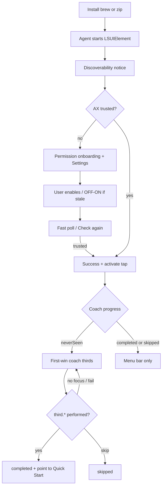
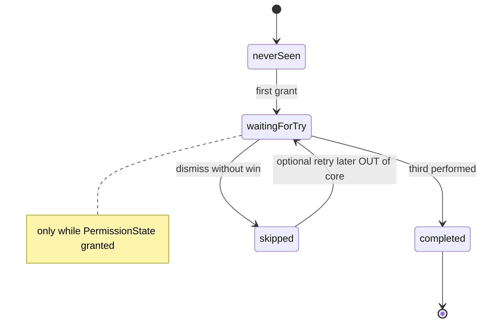

# feat: First-run onboarding and learnability UX

## Summary

Make Quintile learnable for first-time, non–window-manager users: clear post-install launch path (menu bar ⊞, no Dock), Accessibility onboarding that closes the loop (including stale TCC), and a progressive first-win coach (Control+Option + thirds only) with live try detection — while demoting the full keyboard map to reference surfaces and preserving existing permission/hotkey safety invariants.

## Problem Frame

A first-time installer completed Homebrew install and Accessibility enablement but still failed to form a usable mental model:

1. **Launch discovery** — After install, terminal success did not explain that Quintile is a **menu-bar agent** (no Dock icon). Spotlight/`open` can feel like “nothing happened.”
2. **Permission loop** — A warning / blocked state remained even when System Settings appeared to show Accessibility ON (classic stale TCC / untrusted process while UI looks granted).
3. **Teaching failure** — Post-grant **Quick Start** presented the full monospaced shortcut dump and a **Got it** dismissal, leaving the user without a first successful tile.
4. **Modifier opacity** — The entire product sits behind **Control+Option**; without progressive teaching, chords (`G`, `P`, sixths, arrows) read as noise.

The tiling engine and preset set are not the primary problem. Discovery, trust closure, and sequenced teaching are.

**Observed product today:** `OnboardingWindowController` flips to a full cheat sheet on `.granted`; permission poll is 3s while untrusted; cask postflight already opens the app + deep-links Accessibility; no coach persistence, no reopen handler, no first-win detection.

---

## Requirements

- R1. After install (brew and zip), the user can discover how to launch Quintile and where it lives (menu bar glyph), without reading the full shortcut syllabus.
- R2. While Accessibility is not trusted, onboarding offers immediate re-check, stays accurate during Settings navigation (no false “declined”), and on real trust shows a clear success path.
- R3. When Settings may show ON but the process is still untrusted (stale TCC), copy prioritizes **toggle OFF then ON**, not only “you declined.”
- R4. After first grant for a user who has never completed or skipped coach, the primary surface teaches **only** Control+Option + horizontal thirds — not the full map.
- R5. Coach completion requires a real successful third-tile (`ActionOutcome.performed` on `thirdLeft|thirdCenter|thirdRight` from the live hotkey path).
- R6. Full shortcut map remains available from menu bar **Quick Start…** / **Shortcuts…** only as reference after first-run demotion.
- R7. Coach progress persists across launches (`neverSeen` / `waitingForTry` / `completed` / `skipped`); second launch with completed/skipped + granted does not auto-spam coach.
- R8. Re-launch while the agent is already running re-surfaces useful UI when the user is stuck (not granted, or coach waiting) — not a silent no-op.
- R9. First-launch discoverability notice appears in-app at least once (not only README).
- R10. Demo mode (`--demo` / `QUINTILE_DEMO`) must not leave coach stuck or depend on human input.
- R11. Do **not** regress: `deniedGraceChecks` intent (~30s wall-clock grace), grant-only event-tap activate, revoke teardown, cask postflight de-quarantine+open until notarization replaces it.

### Success criteria

- A non–power-user can: install → find menu bar → grant Accessibility → complete one third-tile under coach guidance without a human tutor.
- Power users can still open the full map anytime; defaults and chords unchanged.

---

## Scope Boundaries

### In scope

- Install next-steps copy: `Casks/quintile.rb` caveats + `README.md` install/permission sections
- Permission onboarding UX: faster poll while window visible, wall-clock grace, Check again, success state, stale-TCC copy, optional auto-show on revoke transition
- Progressive first-win coach (thirds only) + try detection + persistence
- Demote full cheat sheet to reference-only entry points
- Menu-bar discoverability + `applicationShouldHandleReopen` (or equivalent) re-surface rules
- Tests for permission grace retune (if changed), coach state machine, first-win recognition

### Out of scope

- Deep Practice syllabus / multi-day progressive curriculum (quarters, sixths, grid `G`, profiles `P` as a guided track)
- Launch marketing / X post copy
- Leader-key remapping product redesign
- In-app video tours
- Notarization / official homebrew-cask notability work
- Changing default hotkey bindings

### Deferred to follow-up work

- Optional **Practice…** menu with multi-step syllabus after first win
- Interactive “hold Control+Option” modifier trainer game
- Stronger event-tap activation failure UI (beyond not claiming hotkeys live)
- Localization of onboarding strings

---

## Key Technical Decisions

### KTD1. Same window: permission → success → coach (not a multi-page wizard)

**Decision:** Keep a single `OnboardingWindowController` surface with render modes: permission / success blip / first-win coach / full reference (Quick Start force). No multi-window wizard.

**Rationale:** Matches existing “one-glance, not multi-step wizard” product history; reduces focus thrash with System Settings.

### KTD2. Coach state is orthogonal to `PermissionState`

**Decision:** Persist `CoachProgress` = `neverSeen | waitingForTry | completed | skipped` separately from Accessibility trust. Coach UI only when granted (or force-reference).

**Rationale:** Permission SM must stay pure TCC truth; teaching progress is a product flag.

### KTD3. First win = third presets only, via `ActionOutcome.performed`

**Decision:** Complete coach only when `performPreset` returns `.performed` for `thirdLeft|thirdCenter|thirdRight` from the hotkey-registered path. Treat `.noFocusedWindow` and `.failed` as waiting-state recovery copy, not completion. Primary teach chord: **⌃⌥[** (siblings ] and \ mentioned after success or as secondary line).

**Rationale:** Aligns with observed tutor script (thirds first); uses existing typed outcomes; avoids false complete from demo unless demo bypasses coach.

### KTD4. Faster poll while onboarding visible; grace is wall-clock ~30s

**Decision:** While the onboarding window is key/visible and not granted, poll trust at ~0.5–1s. When window hidden, keep ~3s. **Do not** keep `deniedGraceChecks = 10` tied to poll count if poll rate increases — retune to **~30s wall-clock** of continuous untrusted time after the launch-prompt path (time-based grace or scaled count).

**Rationale:** Fixes sticky UX lag on grant; protects the v0.1.4 false-decline fix when poll accelerates.

### KTD5. Stale TCC is a first-class copy branch, not a new PermissionState

**Decision:** No fifth trust enum value. When untrusted after user believes they enabled (Check again while still untrusted past a short wait, or denied/revoked with “already ON” path), primary CTA = **Open Settings + toggle OFF then ON**. Avoid “declined” as the only narrative once the user has attempted enablement.

**Rationale:** Process cannot read the Settings toggle truthfully beyond `AXIsProcessTrusted`; OFF→ON is the known fix (`CLAUDE.md`).

### KTD6. Persistence for coach flags

**Decision:** Small dedicated flag store under Application Support (or UserDefaults suite for the bundle) — **not** mixed into `profiles.json` corrupt-quarantine path. Demo mode marks coach `completed` (or suppresses coach) at start.

**Rationale:** Store quarantine already resets grids; onboarding flags must not ride that failure mode.

### KTD7. Reopen behavior

**Decision:** Implement accessory-app reopen handling:

| Condition | On user re-open / second `open -a` |
|-----------|-------------------------------------|
| Not granted | Show permission onboarding |
| Granted + `waitingForTry` | Show coach |
| Granted + completed/skipped | No window (menu bar only) |

**Rationale:** Fixes “Spotlight again does nothing” for stuck users without nagging power users.

### KTD8. Discoverability notice

**Decision:** One-shot in-app signal on first cold start: short menu-bar transient and/or onboarding body line — “Quintile lives in the menu bar (⊞ / ⊞!), not the Dock.” Prefer short status-item transient (existing `showTransient`) over a permanent long title.

**Rationale:** Menu-bar length limits; transient pattern already exists.

---

## High-Level Technical Design

### First-run happy path

### Coach + permission relationship

### Components

| Component | Responsibility |
|-----------|----------------|
| `AccessibilityPermissionManager` | Trust SM; wall-clock grace; no UI |
| `OnboardingWindowController` | Permission / success / coach / reference render modes |
| `AppCoordinator` | Poll cadence, reopen, wire first-win, demo bypass |
| `MenuBarController` | Glyph, transient discoverability, Quick Start entry |
| Coach flag store | Persist progress |
| Cask caveats + README | Install next-steps parity |

---

## Implementation Units

### U1. Install next-steps messaging

**Goal:** Brew and zip users see the same clear post-install recipe: launch, menu bar, Accessibility, first chord.

**Requirements:** R1, R11

**Dependencies:** None

**Files:**
- Modify: `Casks/quintile.rb`
- Modify: `README.md`
- Modify: `docs/HANDOFF.md` (brief polish note under install UX)

**Approach:**
- Rewrite caveats as a short **NEXT STEPS** block: app launched (brew) or how to open (Spotlight → Quintile / Applications); look for **⊞!** / **⊞** in the menu bar (not Dock); enable Accessibility; try **⌃⌥[** on a focused window.
- Align README install + Accessibility sections; demote full key table as “after first tile” / reference.
- Keep quarantine-already-cleared / fallback `xattr` language; do not reintroduce “must xattr” as primary step.
- Keep postflight `open -a` until notarization policy changes separately.

**Patterns to follow:** Existing caveats structure in `Casks/quintile.rb`; HANDOFF “already handled automatically” principle.

**Test scenarios:**
- Test expectation: none -- documentation/cask prose only; verify by human read against R1.

**Verification:** Fresh reader can answer “where is the app?” and “what is the first key?” from caveats alone.

---

### U2. Permission loop-close (poll, grace, Check again, stale copy, success)

**Goal:** Trust UI closes correctly and quickly without false “declined.”

**Requirements:** R2, R3, R11

**Dependencies:** None (can parallel U1)

**Files:**
- Modify: `Sources/QuintileCore/Permissions/AccessibilityPermissionManager.swift`
- Modify: `Tests/QuintileTestRunner/PermissionTests.swift`
- Modify: `Sources/QuintileApp/UI/OnboardingView.swift`
- Modify: `Sources/QuintileApp/AppCoordinator.swift` (poll interval ownership)

**Approach:**
- Retune denial grace to **~30s wall-clock** after prompt path so faster polling cannot collapse the grace window.
- `AppCoordinator`: while onboarding window is visible and not granted, poll ~0.5–1s; otherwise ~3s (existing).
- Onboarding permission modes: always show **Check again** (immediate `refresh` + UI sync) when not granted.
- On transition to `.granted`, brief success title/body (“You’re set”) before coach handoff (U4) — success only from real trust.
- Strengthen denied/revoked (and post–Check again still untrusted) copy: primary path **OFF then ON** when enablement was attempted; keep deep link to Accessibility.
- Optional: on `.revoked` transition, auto-show onboarding once (not every poll tick).
- If event-tap `activate()` throws on grant, do not show “hotkeys are live” footer (stderr already logs; surface short recovery line if cheap).

**Patterns to follow:** Existing four-state SM; `FakeTrustChecker` tests; deep link constant; denied/revoked OFF→ON language already partially present.

**Execution note:** Extend permission tests first for grace wall-clock / count retune before changing production timing.

**Test scenarios:**
- Happy path: untrusted → after trust check true → `.granted`; handlers fire once.
- Edge: after prompt, untrusted for less than ~30s wall-clock → still `.notDetermined` (not `.denied`), even if many fast polls occur.
- Edge: untrusted continuously past grace → `.denied`.
- Edge: grant inside grace window → `.granted`.
- Edge: `.granted` → untrusted → `.revoked` → trusted → `.granted` again (handlers fire again).
- Error/recovery copy (App layer, manual or lightweight test if pure string helper): Check again while still untrusted emphasizes OFF→ON.
- Integration: deep link URL unchanged.

**Verification:** Simulated fast poll does not false-deny within ~30s; grant flips UI within one fast poll interval while window open.

---

### U3. Coach progress persistence

**Goal:** Durable coach states so first-run teaching is once-per-user-path, not every launch.

**Requirements:** R7, R10

**Dependencies:** None

**Files:**
- Create: `Sources/QuintileCore/Persistence/OnboardingProgressStore.swift` (or equivalent small type name)
- Create/Modify: `Tests/QuintileTestRunner/OnboardingProgressTests.swift` (register in `Tests/QuintileTestRunner/main.swift`)
- Modify: `Sources/QuintileApp/AppCoordinator.swift` (read/write at start, demo bypass)

**Approach:**
- Store enum: `neverSeen`, `waitingForTry`, `completed`, `skipped` under Application Support or UserDefaults for bundle id — **isolated from** `profiles.json`.
- API: load, set, markCompleted, markSkipped, markWaitingIfNeeded.
- Demo env/args: force `completed` or skip offering coach at `start()`.
- Default for missing file: `neverSeen`.

**Patterns to follow:** Lightweight persistence next to existing local-only model; keep Core free of AppKit.

**Test scenarios:**
- Happy: default `neverSeen`; set waiting → completed persists across new store instance.
- Edge: skip then load → `skipped`.
- Edge: demo flag path records completed/suppressed so waiting is not re-entered.
- Error: corrupt/missing file recovers to safe default (`neverSeen` or `completed` if unreadable after a known schema — prefer fail soft to `neverSeen` only if never completed; implementer may choose “unknown → neverSeen” and document).

**Verification:** Relaunch simulation does not re-offer coach when `completed`/`skipped`.

---

### U4. Progressive first-win coach + first-tile detection

**Goal:** Replace post-grant full cheat sheet as primary surface with interactive thirds coaching; demote full map to Quick Start reference.

**Requirements:** R4, R5, R6, R7, R10

**Dependencies:** U2 (success handoff), U3 (flags)

**Files:**
- Modify: `Sources/QuintileApp/UI/OnboardingView.swift`
- Modify: `Sources/QuintileApp/AppCoordinator.swift` (`performPreset`, grant → coach)
- Modify: `Sources/QuintileApp/UI/MenuBarController.swift` (labels if needed: Quick Start remains reference)
- Optionally touch: `Tests/QuintileTestRunner/ActionsTests.swift` only if outcome routing helpers move to Core

**Approach:**
- Split render paths:
  - **Coach** (post-grant, progress `neverSeen`/`waitingForTry`): plain-language leader (Control + Option), primary try **[** / left third, secondary mention of ] and \; buttons **I’ve tried it** is not required if auto-detect works — keep **Skip for now** and dismiss = skip.
  - **Reference** (`showQuickStart` / force): existing full monospaced map (or lightly cleaned) for anytime reopen.
- On grant + `neverSeen`: set `waitingForTry`, show coach (after success blip from U2).
- `performPreset`: on `.performed` for thirds while waiting → mark `completed`, update coach UI (“Nice — more shortcuts: menu bar → Quick Start…”), then allow dismiss.
- On `.noFocusedWindow`: coach body “Click a window, then hold Control+Option and press [”.
- On `.failed`: “That app blocked resize — try Finder or Notes.”
- **Got it** on reference sheet dismisses only; does not mark completed unless already completed.
- Do not auto-show full map on grant.

**Patterns to follow:** Existing onboarding stack layout; `ActionOutcome` feedback style (no alerts for tiling); demo tour already uses `performPreset` — bypass coach before tour.

**Test scenarios:**
- Happy: waiting + thirdLeft performed → completed (unit test if detection pure; else integration-style fake coordinator helper).
- Edge: waiting + noFocusedWindow → stays waiting.
- Edge: waiting + quadrant performed → does **not** complete coach.
- Edge: progress completed → grant again does not force coach.
- Edge: skip → reference still available via Quick Start.
- Integration: menu Quick Start still shows full map while coach is skipped/completed.

**Verification:** Fresh grant path never forces the full syllabus before a third-tile or skip; successful third auto-completes coach.

---

### U5. Menu-bar discoverability + reopen re-surface

**Goal:** Users find ⊞ and can recover stuck states by re-opening the app.

**Requirements:** R8, R9

**Dependencies:** U2, U3, U4 (for which window to show)

**Files:**
- Modify: `Sources/QuintileApp/main.swift` and/or `AppDelegate` / `AppCoordinator`
- Modify: `Sources/QuintileApp/UI/MenuBarController.swift`
- Modify: `Sources/QuintileApp/AppCoordinator.swift`

**Approach:**
- On first cold start (progress neverSeen or first run flag): short `showTransient` e.g. “⊞ Quintile” / tooltip already explains permission — strengthen first-run tooltip once.
- Implement reopen: if not granted → `showOnboarding`; if granted && waitingForTry → show coach; else no-op windows.
- Ensure activate/orderFront so user sees the window when reopening from Spotlight.

**Patterns to follow:** Existing `showTransient`; accessory activation patterns already used when showing onboarding.

**Test scenarios:**
- Test expectation: limited — AppKit reopen often manual. If a pure “which surface to show” function is extracted: table-driven cases for (permission × coach) → surface enum.
- Manual verification checklist: not granted + reopen shows permission; waiting + reopen shows coach; completed + reopen shows nothing.

**Verification:** Wife-style path: close all windows, Spotlight Quintile → permission or coach reappears when stuck.

---

## System-Wide Impact

| Surface | Impact |
|---------|--------|
| End users (new) | Primary beneficiaries — first tile without tutor |
| End users (power) | Less auto UI spam; full map still in menu |
| Demo/recording | Must set coach completed / suppress to avoid fighting `--demo` |
| Homebrew caveats | Text change; re-copy to personal tap on release |
| Accessibility TCC | No new permission types |
| profiles.json | Untouched |

---

## Risks & Dependencies

| Risk | Mitigation |
|------|------------|
| Faster poll reintroduces false “declined” | Wall-clock grace tests; keep ~30s |
| Coach never completes (user never focuses a window) | Explicit recovery copy + skip; reopen keeps coach available while waiting |
| Transient menu title crowds menu bar | Short strings; reuse existing duration pattern |
| Demo/CI marks wrong coach state | Force completed at demo start; document in HANDOFF |
| Stale TCC still confusing | OFF→ON primary; Check again; success only on real trust |
| Tap activate fails after grant | Don’t claim hotkeys live; optional recovery line |

**Dependency:** Existing Accessibility deep link and grant-only event-tap wiring remain load-bearing — do not speculative-activate taps.

---

## Documentation Plan

- `README.md` install/onboarding narrative (U1)
- `Casks/quintile.rb` caveats (U1); sync personal tap on release
- `docs/HANDOFF.md` short entry: progressive coach, wall-clock grace, reopen behavior
- `CLAUDE.md` keep stale TCC note; point to new Check again / OFF→ON product path if wording diverges

---

## Open Questions (implementation-time)

- Exact success blip duration before coach (1–2s vs instant replace) — implementer taste, not architecture.
- UserDefaults vs Application Support file for coach flags — either fine if isolated from profiles.
- Whether “I’ve tried it” manual button is needed when auto-detect exists — default **no**, keep Skip only.

---

## Assumptions

- Confirmed scope: interactive first-win + install next-steps + first-launch menu-bar notice; deep Practice syllabus deferred.
- Default chords remain ⌃⌥; no remapping in this plan.
- Notarization remains separate work; cask postflight de-quarantine stays until that lands.

---

## Sources & Research

- Local: `OnboardingView.swift`, `AccessibilityPermissionManager.swift`, `AppCoordinator.swift`, `MenuBarController.swift`, `TilingActions.swift` / `ActionOutcome`, `Casks/quintile.rb`, `README.md`, `CLAUDE.md`, `docs/HANDOFF.md` (v0.1.3–0.1.5 polish history)
- Session feedback: first-time installer friction (launch, sticky permission, Quick Start dump, shortcut teaching)
- External research: not run — strong local patterns for permission SM and onboarding shell
)
